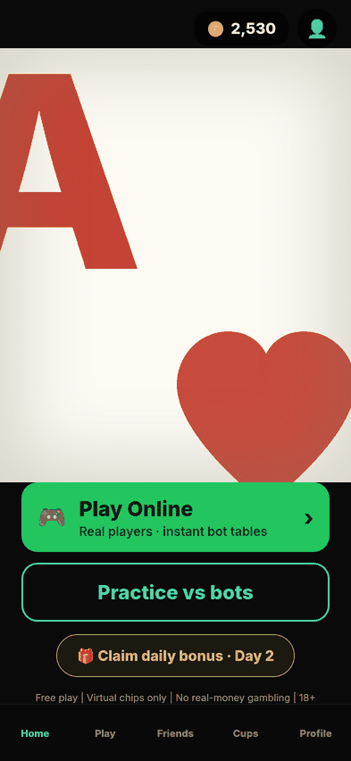
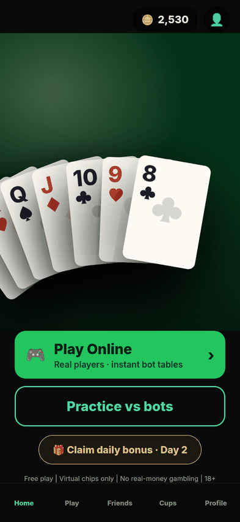
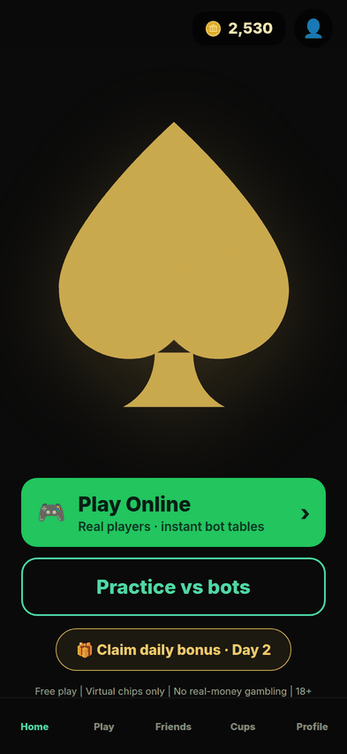

# THIRTY DIRECTIONS — scored on wow, not on legibility

**2026-08-30 · nothing shipped · nothing installed · renders only.**

Ten distinct answers to "what is the first thing you see", three treatments each, at 393 and 320.
Pictures: `docs/thirty-directions/`. Start with `_contact-sheet-393.png`.

---

## How this was set up, and why it is set up that way

**The C2 control set is identical in all thirty renders** — Play Online, Practice vs bots, the
daily-bonus strip, the balance pill, the tab bar, same text and sizes and order as ships today.
The art is the only variable. If the buttons moved between directions, a direction could win on
layout and be recorded as winning on art; and the floor gets measured on the same controls every
time, so a floor failure can only have been caused by the art changing what sits behind them.

**Board count is dynamic and enforced, not remembered.** Every direction that draws boards takes
the count as an argument and is rendered at the home screen's own 3-player default. A guard in
`lib.mjs` throws if any direction's copy claims a fixed count — the app already had to retract
that exact sentence once (FACTUAL FIX 2026-08-11).

**The typography is real.** `fc-list` on this machine returns DejaVu, Liberation, FreeSerif and
Bitstream Charter — nothing a designer would set a masthead in. Judging "heavy expensive
typography" on Liberation Serif would be a verdict about Liberation Serif. So Playfair Display,
Inter, Bebas Neue and Cormorant Garamond are fetched and **embedded as data URIs** (a `<link>`
would let a font arrive late and render the fallback silently, on an unknown subset of thirty
pictures). Playfair is not an outside import — the app already sets `DISPLAY_FONT` to
`'Playfair Display, Georgia, serif'` on web. Every page waits on `document.fonts.ready` and the
audit records which families actually loaded: all four, on all sixty renders.

---

## 1 · THE THIRTY

Ten families. The families disagree with each other about what the screen is for — that is what
"thirty directions" has to mean, rather than thirty variations of one idea.

| | family | treatments |
|---|---|---|
| **A** | A real poker table seen from above | A1 overhead mid-deal · A2 dealer's arc cropped hard · A3 still table, one card lifted |
| **B** | The format itself as the image | B1 boards as lit bars · B2 hand splitting into boards · B3 card grid edge to edge |
| **C** | A single oversized card | C1 ace centred · C2 card bleeding off frame + wordmark · C3 the card back as hero |
| **D** | Heavy typography alone | D1 CAPS gold enormous · D2 editorial masthead · D3 the sentence is the art |
| **E** | Light and shadow on felt | E1 raking light, long shadow · E2 chiaroscuro pool · E3 cards barely emerging |
| **F** | The wordmark as the whole screen | F1 letters cropped by the frame · F2 gold foil emboss · F3 cinema title card |
| **G** | A hand frozen at reveal | G1 one card mid-flip · G2 the winning hand lit · G3 all boards resolving |
| **H** | Chips, physical and stacked | H1 stacks in depth of field · H2 one enormous chip · H3 chips mid-fall |
| **I** | Stark and minimal, one object | I1 one spade screen height · I2 the card as negative space · I3 boards reduced to marks |
| **J** | Texture and material | J1 felt weave, card edge entering · J2 card stock extreme close · J3 felt, foil and stock meeting |

---

## 2 · THE PANEL

Four questions about wow, then the floor. My answers, including about my own work.

**Stops a thumb** is my honest reaction at thumbnail size on the contact sheet — the size a
person actually scrolls past. **Icon** is measured, not asserted: `_icon-test.png` renders each
candidate's art into a square at 1024 / 240 / 120 / 60 and a direction that only works at 1024
has failed.

| | stops a thumb | poker in ½s | says **CAPS** | icon | floor |
|---|---|---|---|---|---|
| A1 overhead mid-deal | no — cards too small, reads flat | yes | **yes** | no | pass |
| **A2 dealer's arc** | **yes** | **yes** | no | no — smears at 60 | 1 contrast (fixable) |
| A3 still table | no — nothing happens | yes | **yes** | no | pass |
| B1 boards as lit bars | no — reads as a settings screen | no | **yes** | no | pass |
| B2 hand splitting | no — a flowchart, not a picture | no | **yes** | no | pass |
| B3 card grid | no — reads as a spreadsheet | yes | **yes** | no | 2 contrast |
| C1 ace centred | mildly | yes | no | ok at 60 | pass |
| C2 card off frame | mildly | yes | no | no | pass |
| C3 card back | mildly | yes | no | ok | pass |
| D1 CAPS gold | **yes** | no — pure type | no | no | pass |
| D2 editorial masthead | no — quiet | no | no | no | pass |
| D3 the sentence | no — quiet | no | partly (the words) | no | pass |
| E1 raking light | no — too dark at thumb size | yes | no | no | pass |
| E2 chiaroscuro | no — almost nothing visible | yes | no | no | 1 contrast |
| E3 barely emerging | no | yes | no | no | pass |
| **F1 cropped letters** | **yes — the best single image here** | **no** | no | **no — dies at 120** | pass |
| F2 gold foil | mildly | no | no | ok as a mark | pass |
| F3 cinema card | no — nearly empty | no | no | no | pass |
| G1 one card mid-flip | no — the flip is invisible small | yes | no | no | pass |
| G2 winning hand lit | mildly | yes | no | no | 5 contrast |
| G3 boards resolving | no — reads as a results screen | yes | **yes** | no | 3 contrast |
| H1 chip stacks | no — flat circles | yes | no | no | pass |
| H2 one enormous chip | **yes** | yes | no | ok at 60 | pass |
| H3 chips mid-fall | no — reads as confetti | yes | no | no | pass |
| **I1 one spade** | **yes** | **yes** | no | **best in set** | pass |
| **I2 card as negative space** | **yes** | yes | no | fades to a dot at 60 | pass |
| I3 boards as marks | no — three circles mean nothing | no | partly, with a caption | no | pass |
| J1 felt weave | no — the card reads as a stray rectangle | partly | no | no | pass |
| **J2 card stock close** | **yes** | **yes** | no | **yes — survives 60** | pass |
| J3 felt/foil/stock | no — says material, not poker | no | no | no | pass |

### The finding that matters more than the ranking

**Six directions say what makes CAPS different. Not one of them stops a thumb.**

A1, A3, B1, B2, B3 and G3 are the only pictures that communicate simultaneous boards, and they
are six of the dullest images in the set. B1 reads as a settings screen. B2 is a flowchart. B3 is
a spreadsheet. G3 is a results screen. The brief listed "the four-board format shown as an image,
since that is the thing nobody else has" — it is the thing nobody else has, and **it does not
photograph.** Multiple boards is a rules fact; rules facts are read, not seen, and a hero image
is not read.

I would stop trying to put the format in the hero. It belongs one layer down — the teaching
sentence already there does it in words, which is the right medium for it.

### The floor, and which failures are fixable

25 of 30 pass at both widths. All five failures are **one defect in five costumes**: a playing
card's rank glyph on a card the art has darkened.

| | what fails | worst | needed | fix |
|---|---|---|---|---|
| G2 | five dimmed "loser" cards, `brightness(0.38)` | 1.14 | 4.5 | lift the dim to ~0.75, or drop ranks on dimmed cards |
| G3 | dimmed board rows + "LOST" in `#c0392b` | 1.72 | 4.5 | same, and take LOST off red-on-dark |
| B3 | two ranks under the fade-to-black gradient | 1.64 | 3 | start the gradient lower |
| A2 | the leftmost card's rank, half off-frame in shadow | 2.10 | 3 | shift the arc ~20px right so no card is half-cropped |
| E2 | one rank at the edge of the light pool | 2.93 | 4.5 | widen the pool |

Every one is a five-minute change. **None is a reason to discard a direction**, which is why they
are reported with their pictures and their numbers.

Zero directions have a control under 44pt or an unnamed control, at either width.

### Three things my own instrument got wrong

Stated because each would have been reported as a finding.

1. **All thirty "failed" contrast in the first pass.** The background was sampled from the
   finished render inside each text box; at 17px the glyphs fill most of that box, so the balance
   pill scored 3.06:1 against itself. A measurement that fails all thirty is a broken instrument.
   The ground now gets its own screenshot with every glyph made transparent.
2. **`👤` scored 1.02:1 on all thirty.** A colour emoji is painted by the font, not by `color` —
   that number is about a colour the glyph does not use. Emoji are flagged, never scored.
3. **All thirty "failed" 44pt at 320** — the profile button at 36×36, the bonus pill at 39 high.
   My control set scaled targets by `W/393`, and `utils/responsive.ts` ships `rb()` — *"always at
   least 44pt"* — used in **four places app-wide and not once on the home screen**. That looked
   like a real defect. So I measured the shipped export: `tests/home-target-audit.mjs` reports
   **20 controls at 393, 375 and 320 with zero under 44pt.** The app is fine; my harness was
   wrong, and it would have shipped a defect report about code that does not have the defect.
   *(It did find one unnamed control on the shipped home at all three widths — small, real, and
   not this sprint's job.)*

And one thing the art got wrong: **J2 first rendered a red spade** — ink-black rank, card-red
suit — on the one direction that is literally a card face. A spade is never red. It is the Ace of
Hearts now.

---

## 3 · MY TOP THREE

Ranked. The icon test moved this list after I had drafted it — A2 was my first choice until the
square showed it dissolving at 60px.

### 1 · J2 — Card stock, extreme close

The only direction that does all three jobs. It stops a thumb, it says poker before you have
read anything, and it is the only one besides I1 that survives being squeezed to 60 pixels.

In visual terms: it is the only **light** picture in thirty. Every poker app on the store is dark
green or black, and so is this one — a cream field with a red Ace is a hole in that page. The
crop does the work: you are close enough to a card that you cannot see all of it, which is a real
photographic idea rather than a decorated logo. The two shapes are simple enough that the 60px
tile still reads as a playing card, where I2's spade has collapsed to a dot and A2's arc to a
smear.

What it costs: it says nothing about the format, and it commits the brand to cream where the app
is currently committed to near-black. That is a decision, not a detail.

### 2 · A2 — Dealer's arc, cropped hard

The best *screen* in the set, and the best store screenshot by a distance. Real cards on real
felt with real light — and it is the product's own material, not a metaphor for it. The hard crop
puts you at the table rather than above it, which is the difference between a photograph and a
diagram.

It is not an icon and I would not try to make it one; the 60px tile is a grey smear. Pair it with
a separate mark.

### 3 · I1 — One spade, screen height

The most confident image here and the best mark: it survives 1024 → 60 unchanged, because there
is nothing in it to lose. Gold on black, one shape, no explanation.

Its cost is honest — a gold spade is every poker app's second idea. It is unimpeachable and it is
not distinctive. As a *screen* it is thin; as an icon paired with A2's screen it is exactly
right.

**Honourable mention — I2, the card as negative space.** The most distinctive palette in the set
and the boldest single decision. Two things stop it: the spade fades to a dot at 60px, and a gold
field puts the mint/green control set into a colour fight the mint loses. Both solvable; neither
free.

**The most beautiful picture that answers the wrong question — F1.** Cropped Playfair at 230px is
the best-looking render I made. It says nothing about poker, and at 120px it reads as a cropped
word rather than a mark. Named here because it deserves to be seen, not recommended.

---

## 4 · WHAT THEY WOULD ACTUALLY COST

Honest separation, per the brief: **library** vs **asset** vs **designer**. These renders are CSS
and SVG in a browser, and the app is React Native. Three things I used do not cross over, and
that is where the real cost is:

- **`react-native-svg` is NOT installed.** The app draws suits as Unicode text glyphs
  (`SUIT_SYMBOLS = { spades: '♠', … }` in `Card.tsx`). My vector suits do not exist in the app.
- **`feTurbulence` grain and felt weave are web-only.** React Native has no SVG filters. Every
  render with texture would need a tiling noise PNG on native.
- **`expo-linear-gradient` IS installed** and already used by `Card`, `BoardSurface` and `Board` —
  so linear gradients are free. **Radial gradients are not**: every spotlight and light pool in
  these renders is radial and would need a PNG overlay or an approximation.

| | engineering | library | asset | designer |
|---|---|---|---|---|
| **J2** | ~25 lines. A large `<Text>` rank + one large suit. Half a day. | none | optional: one grain tile (~20KB) — the direction survives without it. A 250px system heart glyph varies by platform; one vector or PNG fixes that. | a real decision about a light hero in a near-black app |
| **A2** | ~120 lines. `<Card>` already renders standalone at 27 call sites; felt via `expo-linear-gradient` as `BoardSurface` already does; rotation and offset are plain transforms. Half to one day. **Plus the 20px arc shift** that clears its contrast failure. | none | **two, and nobody has made them**: a radial light-pool PNG and a tiling felt-weave PNG. Small, but real. | half a day tuning the shadow ramp is what separates this from looking like CSS |
| **I1** | ~10 lines as a `<Text>` glyph. An hour. | **or** `react-native-svg`, if the mark must be identical across iOS / Android / web | **or** one vector/PNG spade — the cheaper answer, and the right one for something that becomes the app icon | a mark this simple lives or dies on its silhouette; worth a designer even at ten lines |

**No new animation library is required by any of them, and none of them is animated.** The
finding that sent this sprint was that art is missing, not motion, and all three top directions
are static.

**None of the top three needs artwork that only a photographer could take.** The three directions
that do — H1, H2, H3, and A1 — all scored badly anyway. That is a convenient result and I checked
it twice rather than believing it: a conic gradient is not a moulded clay chip and CSS blur is not
depth of field, so the chip family's renders undersell the idea. Even so, a chip-forward hero
argues against the app's own positioning — the legal strip on every screen reads *"Free play |
Virtual chips only | No real-money gambling | 18+"*, and a hero made of casino chips says the
opposite of that in half a second.

---

## Artefacts

| file | what it is |
|---|---|
| `docs/thirty-directions/_contact-sheet-393.png` · `-320.png` | all thirty, both widths, each tile labelled with its ID and floor verdict (verified: 30/30 carry a verdict at both widths) |
| `docs/thirty-directions/_icon-test.png` | seven candidates at 1024 / 240 / 120 / 60 |
| `docs/thirty-directions/<ID>-393.png` · `-320.png` | sixty full renders |
| `docs/thirty-directions/floor-audit.json` | every text node, every control, both widths |
| `tools/thirty-directions/` | `lib.mjs` shell + primitives · `directions.mjs` the thirty · `render.mjs` render + floor audit · `sheet.mjs` · `icons.mjs` |
| `tests/home-target-audit.mjs` | the shipped home's touch targets at 393 / 375 / 320 |

## Nothing shipped · nothing installed · production unchanged

No app source was modified. No dependency added — the fonts are cached outside the repo and
embedded at render time only. `KILL_Board` and `KILL_game` remain `true`. Felt, panels, cues,
faucet values, economy, rake, missions and payment flags all untouched. The dead branches from
handoff 124 are untouched — that is its own queued sprint.
