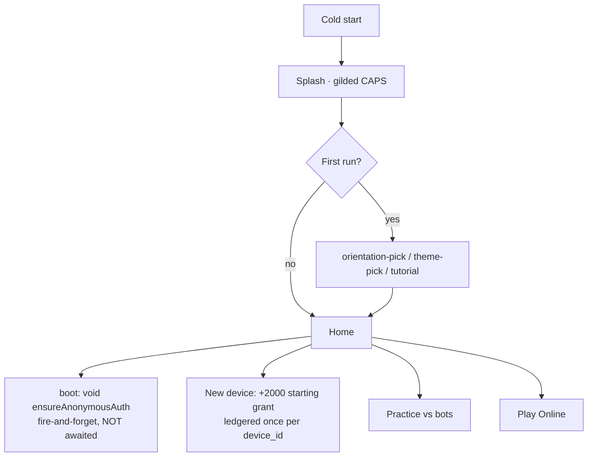
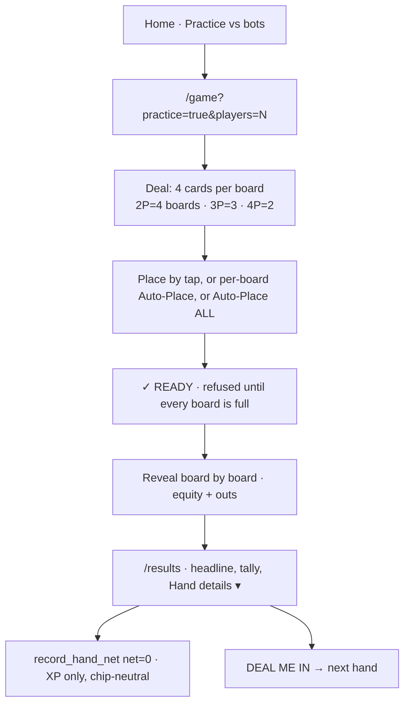
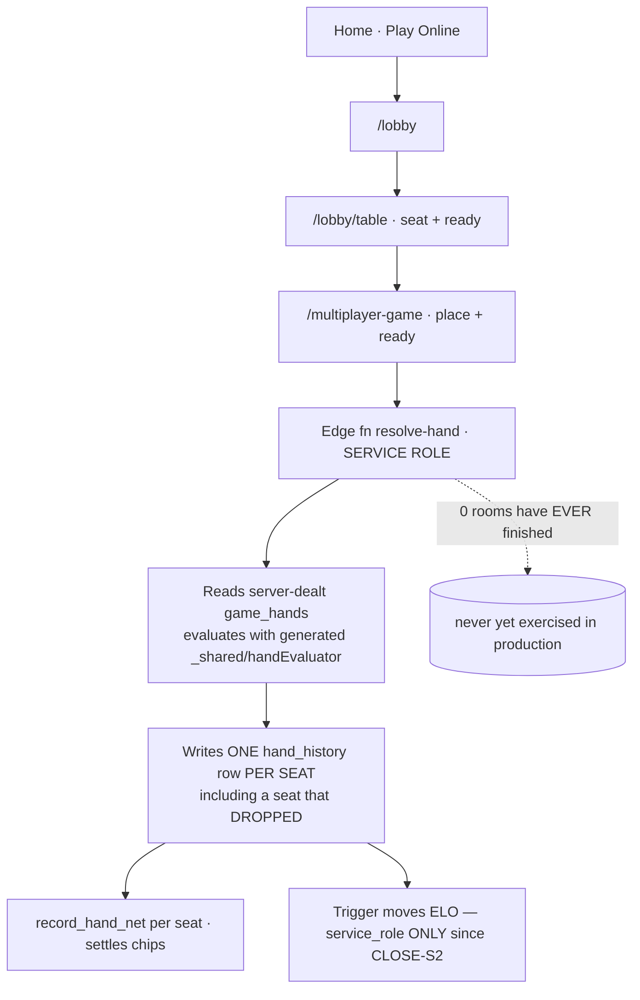
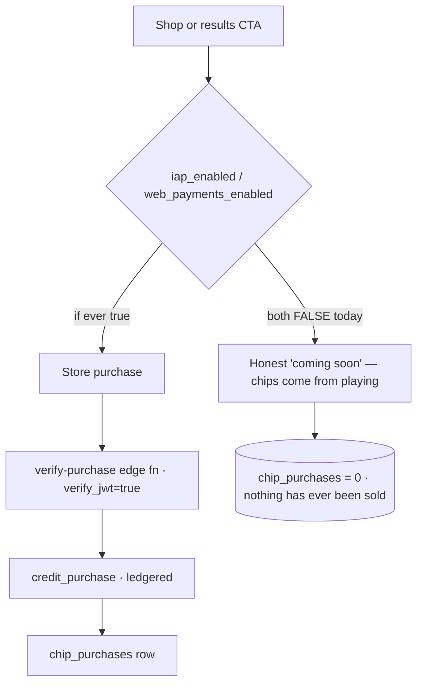
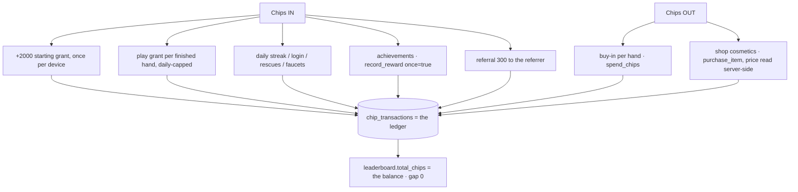

# VAMOS CAPS — INVENTORY-AND-MAP (2026-09-03)

Find what already exists. Map the product as it is TODAY. **Create nothing.**
Repo @ `4f3b2b7` (branch `claude/vamos-caps-align-celebration-flppo0`). Supabase `gxrpunvhjcrzqnitbqah`.
Everything below is checked against code, disk, or the live DB. Where I could not check, it says so.

---

## 0 — Two corrections to the record, first

1. **`vamos_handoffs` lives on the CAPS project (`gxrpunvhjcrzqnitbqah`), not Empire HQ.** Last
   session I looked for it on Empire HQ (`vjxqlqtlywovnbidovit`), found nothing, and wrote the
   CLOSE-S1-S2 handoff to Empire HQ's `bot_handoff_log` instead. The channel's last entry was
   therefore **159 (TOTAL-AUDIT)**, and CLOSE-S1-S2 was missing from it. Corrected this sprint.
2. **CLAUDE.md says "5 tabs: בית/שחק/חברים/כוסות/פרופיל". That is STALE.** The app has had
   **3 tabs** since `eaf9201` (2026-08-31): Home · Play · Profile. Friends and Cups are still
   routes but are registered `href: null` — off the tab bar, reached from elsewhere. Confirmed in
   `app/(tabs)/_layout.tsx` and visible in the committed screenshots.

---

## 1 — WHAT EXISTS

### 1a · The CAPS repo — asset totals
1,091 PNG · 96 JPG · 18 JPEG · 2 WEBP · 2 MP4 (excluding `node_modules`, `.git`, `web-*dist`).
Most are historical QA renders. The directories that matter:

| Path | Files | Size | What it depicts | Current? |
|---|---|---|---|---|
| `assets/` | 8 | — | App icon, adaptive/android icons, favicon, **splash.png + splash-icon.png** | **YES** — splash re-cut 2026-09-02 to the luxury identity |
| `public/landing.html` | 1 | 20.7 KB | The live bilingual landing page (EN/HE, RTL, auto-detect) | **YES** (2026-09-02) |
| `public/shots/` | 2 | 93 KB | `game-boards.webp`, `game-reveal.webp` — the landing's two hero shots | **Mostly** — shot 2026-09-02, before nothing visual changed since |
| `docs/splash-landing/` | 25 | 12.1 MB | Splash + landing renders at 320/393/430, EN+HE, letterbox tests, proofs | **YES** (2026-09-02) |
| `docs/thirty-directions/` | 88 | 5.3 MB | 30 home-screen art directions (A1–?3) at 320 + 393, contact sheets, icon test | **Superseded** — D1 won and shipped; the other 29 are decision history |
| `docs/d1-home/` | 13 | 6.6 MB | The winning D1 home, 320/375/393/430 × chromium/webkit, + approval sheet, + CAPS icon 60/120 | **Superseded** by the 09-01 luxury build |
| `docs/button-styles/` | 16 | — | Round vs elongated chip button studies, contact sheets, built renders | **Superseded** — E/elongated shipped as `ChipButton` |
| `docs/game-preview/` | 16 | 6.9 MB | Game screen before / shipped-3 / all-5 at 320+393, placing + reveal, ladder sheet | **Superseded** (09-01) |
| `docs/total-audit/` | 22 | 3.3 MB | The 2026-09-02 audit renders + a11y JSON | YES (evidence, not marketing) |
| `3D-Renders/` | 15 | 1.4 MB | **15 CAPS-branded physical card-protector product renders** (classic, crystal, VIP gold, neon vegas, royal flush, stealth, LED base…) dated 2026-03-25 | **Unused** — real brand art, never used in-product or in marketing |
| `docs/Screenshots/` | 115 | 26.9 MB | Historical screenshots | **STALE** (pre-luxury) |
| `screenshots/before,after` · `panel-compare/*` · `reality-check-*` · `caps-2026-05-*` · `caps-ux-audit/*` | ~350 | ~60 MB | Historical QA/diff renders, May–Aug | **STALE** — decision history only |
| `backstop_data/bitmaps_reference/` | 12 | 1.4 MB | The CI visual-regression baselines (English) | YES (test infra) |

### 1b · `../caps-content` — the ten marketing videos (the real find)
29 files. **10 finished MP4s, all 1080×1920 vertical (TikTok/Reels/Shorts), 25 fps, no audio
track**, cut 2026-08-28 from Playwright captures of the real app (2026-08-27), plus 10 poster PNGs
and 5 raw WebM sources.

| id | kind | secs | size | hook → payoff |
|---|---|---|---|---|
| `play-autoplace` | gameplay | 9 | 722 KB | "16 cards. One tap." → sixteen cards land across four boards in one tap |
| `play-reveal` | gameplay | 17 | 3.3 MB | "One hand. Four boards." → four boards resolve one after another |
| `play-win` | gameplay | 17 | 2.8 MB | "Take one board? Fine." → all four taken, top celebration tier |
| `play-tie` | gameplay | 17 | 2.8 MB | "Four boards. Four results." → 2–2, the app says TIE GAME in its own words |
| `play-felt` | gameplay | 9 | 689 KB | "This green is four days old" → the surface, measured not eyeballed |
| `dev-signin` | devlog | 20 | 3.1 MB | "Our sign-in button was invisible" |
| `dev-achievements` | devlog | 18 | 3.1 MB | achievements devlog |
| `dev-invite` | devlog | 20 | 3.1 MB | invite devlog |
| `dev-tie` | devlog | 18 | 3.0 MB | tie devlog |
| `dev-wcag` | devlog | 18 | 3.0 MB | accessibility devlog |

Total 25.75 MB. `out/publish-manifest.json` carries per-video sha256, captions and an upload target
(`ftable.co.il/caps-media/v1/`). **Nothing was ever published** — the manifest says so explicitly and
no credential is stored.

⚠️ **ALL TEN ARE STALE.** They were cut 2026-08-28. **84 commits have landed since**, including
every visual change that matters: nav 5→3 tabs (`eaf9201`, 08-31), the entire Luxury pass — home
rebuilt, `ChipButton`, game felt/chip/panel/slot, results/profile/shop/lobby (09-01), the results
IA rethink (`c075f6b`, 09-01), splash rebrand + landing (09-02), and **Hebrew UI going live**
(`52df7cc`, 09-02). Every video shows the previous app.

### 1c · **THE CAPTURE RIG — the most valuable thing in the inventory**
`tools/` holds a complete, working, deterministic video rig (2026-08-27/28):
`content-lib.mjs` (serving, practice guard, browser, seeded storage), `find-seeds.mjs` (which seeds
produce a win/tie — **WIN 3,7,14,15,16 · SWEEP 8 · TIE 5,9,10,12**), `capture.mjs` (the five
scenes), `find-action.mjs`, `cut.mjs` (the ten cuts, constraints as assertions), `publish-manifest.mjs`,
`verify-hosting.mjs`, `contact-sheet.mjs`. It pins `Math.random`, so a seed is a reproducible hand,
and it **refuses any non-practice route** by construction.
**The rig is not stale — only its output is.** Re-running it against the current build regenerates
all ten videos. I used its `serve`/`launch` helpers for this sprint's screenshots.

### 1d · Elsewhere on disk
Swept the whole filesystem. Outside the repo there is only `/home/user/caps-content` and
`/tmp/verify-hosting/` + `/tmp/vidtest/` (copies of the same MP4s from the hosting check).
**There is no `C:\Projects` on this machine** — this is a Linux container holding one repo.

---

## 2 — BAILEY

**I could not find BAILEY, and I am not going to guess at its contents.** Three independent checks:

1. **Disk:** `find /` for `*bailey*` → **nothing**. No `C:\Projects` analogue exists here
   (`/mnt/attach`, `/mnt/skills`, `/mnt/user-data` only).
2. **GitHub:** listed all **34 repos** on the account. **No repo named BAILEY.**
3. **Written record:** `grep -ri bailey` across the repo → only **"Baileys"**, an unrelated
   unofficial WhatsApp Node library, in two WhatsApp-bot research docs. **Zero references to a
   BAILEY studio anywhere in CAPS's 159 handoffs, MEMORY.md or docs/.**

**Conclusion: BAILEY is local-only on Roye's Windows machine (or under another account), and is
unreachable from this session. Its CAPS material cannot be inventoried from here.**

**Candidates, from `docs/2026-03-27_0450_CAPS_royea-master-project-map.md` (7 sibling projects):**
`ExplainIt` (📖 "Education App", `royea-beep/ExplainIt`, last push 2026-06-01) is the closest match
to a video/explainer studio; `PostPilot` (✉️ "Content Tool"), `analyzer-standalone` (🔬 "Video
Analysis") and `trivia-mascots` (character/mascot art, built for 9Soccer) are the other plausible
homes. The same map records a **"HeyGen avatar pipeline — AI video generation"** used by 9Soccer for
character videos — the nearest thing to a character/VO pipeline this empire already owns.

**To inventory BAILEY I need one of:** its path on the Windows box, or its GitHub repo name, or a
zip. Ask me again with any one of those and I will complete this section.

---

## 3 — THE WRITTEN RECORD: what was already decided about brand & marketing

- **Brand identity (current, 2026-09-01/02):** "Luxury Dark" — green felt `FELT_GRADIENT.classic`
  `['#003115','#062E18']`, card face `#FCFAF3`, a **gilded serif CAPS wordmark**, brass hairlines,
  and `ChipButton` (the elongated "E" chip) as the one CTA shape. Gold is reserved for *winning*,
  never for a CTA — there is an explicit `goldButtonHits = 0` check on the live bundle.
- **`docs/CONTENT-ENGINE-2026-08-27.md`** — the video engine's own record: format measured off the
  file, why 486×864 is the capture size (widest true 9:16 still inside the app's phone breakpoint),
  the upscale cost stated honestly, and the seed table. Read this before re-shooting anything.
- **`docs/VIDEO-HOSTING-2026-08-28.md`** — hosting requirements measured on the real host
  (HTTPS, 0 redirects, `Accept-Ranges: bytes`/206, `video/mp4`).
- **`APPSTORE_METADATA.md`** — store listing copy (the closest thing to an existing brand voice doc).
- **`docs/2026-03-28_0619_CAPS_caps-bible-audit.md`** — the "CAPS bible" audit.
- **3D card-protector renders (2026-03-25)** — 15 physical-product concepts, with a design doc and a
  project-save. Brand art nobody has used since March.
- **Landing copy decisions (2026-09-02):** claims must be **flag-stable in both languages** (no
  claim that a flag could falsify), a social-casino disclaimer, "Free play | Virtual chips only |
  No real-money gambling | 18+", no signup wall, one CTA (play in browser).
- **The recurring lesson, twice learned:** MEMORY.md 2026-08-01 — *"we spent weeks on threat models
  without checking whether the threatened behaviour occurs… Read the DB for BEHAVIOUR before reading
  it for THREATS."* The same lesson produced this sprint.

---

## 4 — PRODUCT MAP (verified 2026-09-03)

### 4a · Navigation shape
**3 tabs** (`app/(tabs)/_layout.tsx`): **Home** (`/`) · **Play** (`/play`) · **Profile** (`/profile`).
**Hamburger SideMenu on Home** (`components/SideMenu.tsx`) is the secondary surface: Friends ·
Battle Pass · Coaching · Tutorial · Language toggle (EN/עברית) · Sign in.

### 4b · Every screen
37 route files. R = reachable in-app · **URL** = route exists but nothing links to it · ↩ = retired redirect.

| Route | Purpose | Player can | Reached from | Status |
|---|---|---|---|---|
| `/` | Home / brand | Play Online, Practice vs bots, claim daily bonus, open menu | tab | R |
| `/play` | Mode picker | Quick private table, join by code, practice seats | tab | R |
| `/profile` | Identity + stats | View name/stats, sign in | tab | R |
| `/friends` | Friends list | see friends | SideMenu | R (off tab bar) |
| `/cups` | **Trophy collection** (bronze→diamond, 5 tiers) | view earned/total | Home | R (off tab bar) |
| `/game` | **The game** — place 4 cards per board across 2–4 boards | select/place cards, per-board Auto-Place, Auto-Place ALL, ✓ READY | Home, Lobby | R |
| `/results` | Hand outcome | see headline + tally, expand Hand details, share, DEAL ME IN / rematch | after a hand | R |
| `/lobby` | Multiplayer lobby | join a human table, start bot table | Home "Play Online" | R |
| `/lobby/table` | Seated table | wait/ready/leave | lobby | R |
| `/lobby/private` | Private table | create/share/join by code | `/play` | R |
| `/multiplayer-game` | MP hand | place, ready, reveal | lobby/table | R |
| `/shop` | Cosmetics + chips | buy cosmetics; honest "coming soon" while payments off | Home, results | R |
| `/settings` | Settings | language, sound, account deletion, report a bug, simulate | Profile/menu | R |
| `/achievements` | 158 achievements | view unlocked | menu/profile | R |
| `/leaderboard` | Ranking | view top 20 | Home | R |
| `/hand-history` | Past hands | list, open replay | menu | R |
| `/replay` | Replay a hand | step a saved hand | hand-history | R |
| `/stats` | Player stats | view | profile | R |
| `/rank` | ELO rank detail | view | profile | R |
| `/referral` | Invite friends | copy/share invite link | menu | R |
| `/coaching` | Coaching | tips | SideMenu | R |
| `/battle-pass` | Battle pass | view tiers/XP | SideMenu | R **but `battle_pass_enabled=false`** |
| `/gameover` | Out of chips | rebuy path | game | R |
| `/orientation-pick`, `/theme-pick` | Onboarding pickers | choose | first run | R |
| `/club/[code]`, `/invite/[code]` | Deep links | join club / accept invite | **external link only** | URL |
| `/simulate` | Dev simulation | run sims | Settings | R (dev-ish) |
| `/debug` | Debug overlay | diagnostics | Settings | R (dev-ish) |
| `/spectate` | Spectate a table | watch | **nothing links it** | **URL — orphan** |
| `/missions` | — | — | — | ↩ **RETIRED** → `/` (2026-08-22) |
| `/chip-store` | — | — | — | ↩ **RETIRED** → `/shop` (2026-08-31) |
| `/heatmap` | — | — | — | ↩ **RETIRED** → `/` (2026-08-31) |

### 4c · Features — working / dormant / retired (each checked)

**WORKING**
- **The multiboard format.** Board count is dynamic: **2P=4 boards, 3P=3, 4P=2**; **4 cards per
  player per board**; 5 community cards per board; one 52-card deck; max 4 players. The game screen
  header reads "PLACE 16 CARDS" at 2P (4×4) — verified in the captured shot.
- **Practice vs bots** — fully client-side, chip-neutral (settles `record_hand_net` with net 0),
  XP only. The results screen states it: "Practice vs bot — XP only, no chips".
- **Ties are first-class** — a board can tie, and a hand can tie; the tally is read, never derived.
- **Two currencies** — the REAL balance is exactly `leaderboard.total_chips` (server, ledgered;
  `leaderboard.chips` is a generated read-alias). Practice is client-local and chip-neutral. Ledger
  re-baselined 2026-09-01 so float = ledger, **gap 0** (verified today: 512 rows, 1,030,350 chips).
- **Cups** — 5 tiers defined, 6 device_cups awarded.
- **Achievements** — 158 defined, granted via `record_reward(once=true)`.
- **Hand history + replay + sharing** — 599 `shared_hands` rows; auto-saved per hand.
- **Referrals** — 2,008 `referral_links`.
- **Shop cosmetics — four families**, visible in `chip_config`: **avatar** (+mythic), **card_back**
  (+graphite), **emotes** (+deadpan), **table_theme**.
- **Languages** — EN + HE live since 2026-09-02, RTL mirrored. **Coverage is partial** (§4d).
- **Server-adjudicated multiplayer** — `mp_server_adjudication_enabled=true`, the `resolve-hand`
  edge function writes one row per seat including a seat that dropped.

**DORMANT (built, not reachable or not on)**
- **Payments** — `iap_enabled=false`, `web_payments_enabled=false`; `chip_purchases` = **0**. Shop
  shows an honest "chips come from playing" state.
- **Battle pass** — `battle_pass_enabled=false`, yet the SideMenu still links `/battle-pass`.
- **Missions** — **0 of 20 active**. 3,801 `user_missions` rows with **zero progress ever**, caused
  by a vocabulary mismatch (client sends `games_played/games_won/boards_won`; no mission uses those
  types). Screen retired to a redirect; definitions deactivated, not deleted.
- **`KILL_Board`** — hardcoded `true` in `utils/animationKill.ts`, so every repeating board
  animation is a dead path (crash isolation, never re-examined).
- **The lobby is empty** — **9 `game_rooms`, 0 ever `finished`, 0 `room_players`**. No multiplayer
  hand has ever completed in production. `hand_history` holds only `quick_poker` (53) and `practice`
  (23) rows — **no `multiplayer` rows exist**.
- **Solo no longer moves the ladder** — as of 2026-09-03 (CLOSE-S2) the leaderboard is
  server-authoritative: only the service-role writer (adjudicated multiplayer) moves ELO. With an
  empty lobby, **nobody currently climbs**. Accepted deliberately.
- **Only 8 devices have ever played a hand** (76 hands) out of 512 registered.

**RETIRED** — `/missions`, `/chip-store`, `/heatmap` (redirects, with reasons in-file);
per-hand `earn_chips` credits; the second ELO writer (`update_leaderboard_elo`); the direct client
`hand_history` insert; subscriptions.

### 4d · Language — ENGLISH-FIRST (corrected 2026-09-03)

⚠️ **CORRECTION TO THIS DOCUMENT'S ORIGINAL FRAMING.** The first version of §4d was headed
"Hebrew coverage" and listed ten screens as "**Still** 100% English", implying a gap. **That was
wrong, and it is retracted.** CAPS is a GLOBAL app: **English is the default and primary
language**, and Hebrew exists for the Israeli pilot only — a pilot that will itself include
players from anywhere. Hebrew is an addition, never the requirement. **A screen rendering English
is the correct state, not a defect.**

**The real defect is the half-state**, and it is a consistency problem, not a translation
shortfall: the app *offers* Hebrew and then delivers English on most screens, and leaks English
strings into the screens it did translate. Either a screen is translated, or the app should not
claim that language for it.

Measured as % Hebrew characters of visible text per screen (evidence, not a target):

| Translated | Partly translated | English only (correct default) |
|---|---|---|
| cups 100% · profile 63% · home 61% · game 48–51% · results 41% · play 37% | hand-history 23% · friends 10% · settings 4% | shop · achievements · leaderboard · stats · rank · referral · coaching · battle-pass · lobby · lobby-private |

Two live leaks on the otherwise-Hebrew **home** — the daily-bonus chip ("🎁 Claim daily bonus ·
Day 2") and the legal line stay English. These are the half-state made visible, and are the part
worth fixing. FINISH-HEBREW wired only the game/reveal/results/home flow, which is why the split
falls where it does.

### 4e · Flows











### 4f · Screenshots — committed, both languages, current build
**44 shots** (22 EN + 22 HE) at 393×852 @2x, rendered from a **fresh `expo export` of `4f3b2b7`**,
in `docs/product-map/shots/{en,he}/`, with `shots-report.json` + `shots-report-game.json` recording
bytes, URL and measured Hebrew %.
Covered: home · play · profile · friends · cups · shop · settings · achievements · leaderboard ·
hand-history · stats · rank · referral · coaching · battle-pass · lobby · lobby-private ·
game-placement · game-placed · game-reveal · results · results-details.

⚠️ **Honest limits.** (1) Captured with an **offline guard** — every request to Supabase/ftable is
aborted, so no production write and no device_id was minted; data-driven screens
(leaderboard, achievements, shop, stats) therefore show their **empty/offline state**, not populated
data. (2) `/multiplayer-game`, `/lobby/table`, `/replay`, `/club/[code]`, `/gameover`, `/spectate`
need live state or a second client and are **not** captured. (3) The captures are web renders of the
phone layout, not a physical device.

```bash
git show 4f3b2b7 --stat                       # the CLOSE-S2 fix that precedes this sprint
git log --oneline -1 -- docs/product-map/     # this map + the 44 shots
```

---

## 5 — RECOMMENDATIONS (nothing built)

### REUSE AS-IS
- **The capture rig (`tools/`)** — deterministic, seed-pinned, practice-guarded. The single most
  reusable asset here.
- **The seed table** — WIN 3,7,14,15,16 · SWEEP 8 · TIE 5,9,10,12. Re-usable verbatim.
- **The ten hooks and captions** — the writing is good and product-true ("One hand. Four boards.
  Four separate results."). The words survive even though the footage does not.
- **`public/landing.html`** — live, bilingual, RTL, instant (~74 KB first paint), legally worded.
- **The Luxury Dark identity + `ChipButton` + gilded splash** — current and coherent.
- **`docs/CONTENT-ENGINE` + `VIDEO-HOSTING`** — the measured constraints; do not re-derive them.

### REFRESH
- **All ten videos** — footage predates 84 commits. Re-run the rig; keep hooks/captions.
- **`public/shots/*.webp`** — re-shoot from the current build for consistency with the new set.
- **`CLAUDE.md`** — the "5 tabs" line is wrong; also add that solo no longer moves the ladder.
- **The five `dev-*` devlog videos** — they describe fixes from a version that no longer looks like
  this. Lower value than the gameplay five; refresh only if the devlog channel continues.

### MISSING (genuinely does not exist)
- **Any screenshot set of the secondary screens** until this sprint — now filled (44 shots).
- **A product map** — this document is the first.
- **Consistency of the language offer** — NOT translation. English on those ten screens is
  correct; the defect is that the app offers Hebrew and then does not deliver it uniformly, and
  leaks English into the two Hebrew-home strings above. Fix the *claim*, or fix the leaks — do not
  mass-translate.
- **Any footage of multiplayer** — impossible today: 0 rooms have ever finished.
- **A character / mascot / voice for CAPS** — none exists in this repo. (`trivia-mascots` is 9Soccer's.)
- **App-store screenshot set** at required device sizes.
- **Any published marketing** — nothing has ever been posted.

### BAILEY VERDICT — **restart from the current product, do not update**
Reasons, not sunk cost:
1. **Its input was already obsolete before it was stale.** Anything BAILEY built describes an app
   that has since changed nav (5→3 tabs), every screen's visual identity, the results information
   architecture, and its language. That is not a touch-up; it is a different product surface.
2. **Re-shooting is nearly free and updating is not.** The rig regenerates all ten videos
   deterministically from the current build. Hand-editing existing footage costs more than a re-run
   and still yields the old UI underneath.
3. **What is worth carrying over is the writing, not the footage** — hooks, captions, story beats,
   any character/VO decisions. Those are cheap to port and expensive to re-invent.
4. **Caveat, stated plainly:** I could not open BAILEY. If it contains a *character*, a voice, or a
   style bible — things that are not screen recordings — those are exactly the assets that survive a
   product redesign and should be kept. Send me the path or repo and I will revise this verdict.

### LANDING PAGE — what exists, what is needed
**Exists:** the page itself (bilingual, RTL, legal line, one CTA, instant), and two hero shots.
**Needed:** re-shot heroes from the current build; a multiplayer proof-shot (blocked — empty lobby);
optionally one short looping gameplay clip; and a decision on whether the page should show the
Hebrew UI to Hebrew visitors (it currently shows English chrome shots to both).

### RANKED BY VALUE OVER EFFORT
1. **Re-run the capture rig against the current build** — hours, regenerates 10 videos + fresh
   stills, kills the staleness problem at its root. *Do this first.*
2. **Re-shoot the two landing heroes** — minutes, from the same run.
3. **Fix CLAUDE.md's stale nav/ladder lines** — minutes, prevents the next stale-map error.
4. **Resolve the language half-state** — close the two Hebrew-home leaks, or stop offering Hebrew
   on screens that do not deliver it. English-first is correct; do NOT mass-translate.
5. **App-store screenshot set** — needed before submission regardless.
6. **A CAPS character/voice** — highest cost, lowest urgency; decide only after BAILEY is opened.

**What I would do first:** re-run the rig. It converts the single largest stale asset (ten videos)
into ten current ones for the price of a build, and everything else — landing heroes, store shots,
the map's imagery — falls out of the same run.

---

## 6 — CREATED NOTHING
No landing page, no video, no marketing asset, no diagram beyond this product map. No app code,
economy, security fix or flag touched. No merge, no version bump. Added: this document, 44
screenshots and two JSON reports under `docs/product-map/`. Production is unchanged.
